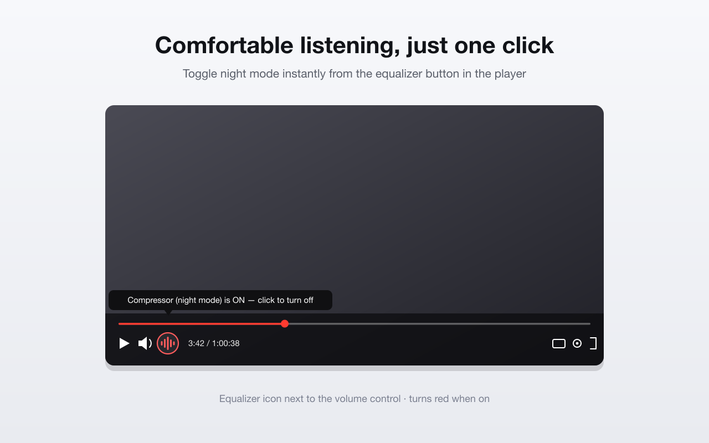
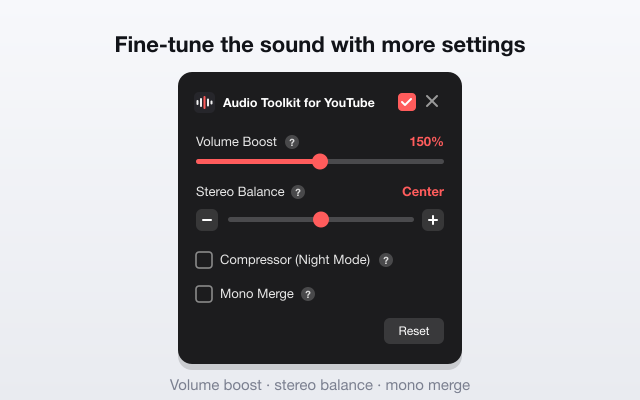

<div align="center">

# 🎧 Audio Toolkit for YouTube

**Shape YouTube's sound to your ears, right where you're watching**

[](https://chromewebstore.google.com/detail/audio-toolkit-for-youtube/jblkbgeldjiabofmekfpdcndpbpmjogd)
[](https://chromewebstore.google.com/detail/audio-toolkit-for-youtube/jblkbgeldjiabofmekfpdcndpbpmjogd)


[한국어](README.md) · English

### [🎧 Install from the Chrome Web Store](https://chromewebstore.google.com/detail/audio-toolkit-for-youtube/jblkbgeldjiabofmekfpdcndpbpmjogd)

</div>

---

## Preview

<div align="center">
  
  <br><br>
  
</div>

## About

Every YouTube video seems to have its own volume, and at night a sudden ad or sound effect sends you reaching for the volume again. Audio Toolkit for YouTube is a small, focused tool for exactly those moments. You can shape the sound right from the page you're already watching, and it starts working as soon as it's installed — no setup required.

## Features

| Feature | When it helps |
| --- | --- |
| 🔊 **Volume Boost** | When the sound is still too quiet at max volume, it goes past 100% up to 200%. |
| 🌙 **Compressor (Night Mode)** | Gently tames loud peaks so late-night ads and effects don't make you jump. |
| 🎚️ **Stereo Balance** | Re-centers the sound when it leans to one side. |
| 🔉 **Mono Merge** | Folds both channels into one so a single earbud still gives you the full mix. |
| ⏻ **Master On/Off** | Drops everything back to the original audio whenever you want. |

## Installation

Add it straight from the [**Chrome Web Store**](https://chromewebstore.google.com/detail/audio-toolkit-for-youtube/jblkbgeldjiabofmekfpdcndpbpmjogd) with "Add to Chrome".

Prefer to load it from source? Use developer mode:

1. Clone this repository or download it as a ZIP.
2. Open `chrome://extensions` in Chrome.
3. Turn on **Developer mode** in the top-right corner.
4. Click **Load unpacked** and pick this folder — that's it.

## Usage

Night mode is the setting you'll toggle most often, so it lives right on the player. Click the equalizer icon next to the volume control to switch the compressor on; while it's active, the icon stays red.

Settings you tend to set once — volume boost, stereo balance, mono merge — live in the popup you get from the toolbar icon. Both surfaces share their state in real time, and hovering the `?` next to each option tells you when it's worth using.

## How it works

It's a Manifest V3 extension written in plain JavaScript, with no external libraries. Audio is handled through the Web Audio API by tapping the `<video>` element, and the signal flows in this order:

```
video → [compressor] → gain → panner → [mono] → destination
```

## Privacy

Nothing about you is collected or sent anywhere. Your settings stay in your own browser and never leave it. The full details are in the [Privacy Policy](PRIVACY.md).

## License

[MIT](LICENSE)

---

<div align="center"><sub>Not affiliated with or endorsed by YouTube or Google.</sub></div>
