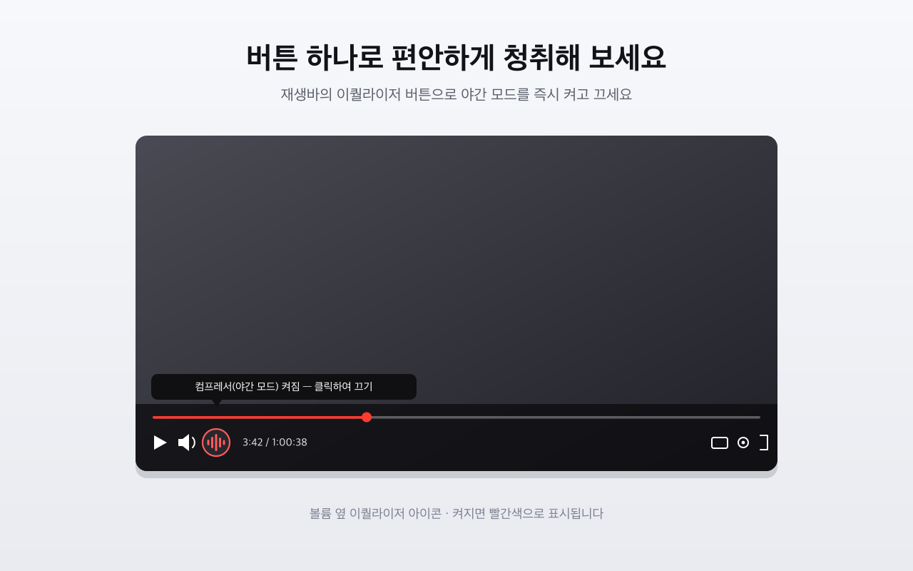
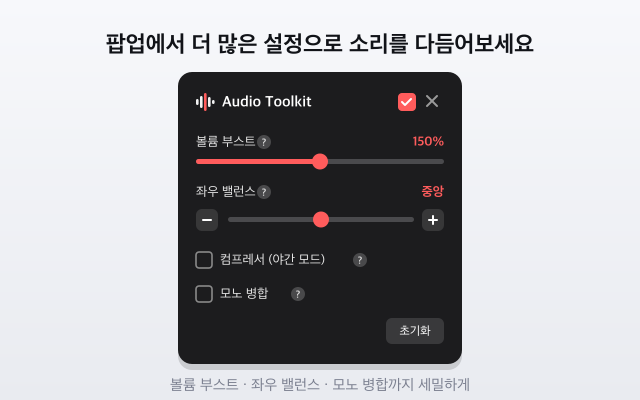

# 🎧 Audio Toolkit for YouTube

**유튜브 오디오를 실시간으로 다듬는 크롬 확장 프로그램**

볼륨 부스트 · 컴프레서 · 모노 병합 · 좌우 밸런스를 플레이어 안에서 바로 조절하세요.

한국어 · [English](README.en.md)

---

## 미리보기

  
    
  

## 기능

| 기능 | 설명 |
| --- | --- |
| 🔊 **볼륨 부스트** | 유튜브 기본 상한(100%)을 넘어 최대 200%까지 증폭 |
| 🌙 **컴프레서 (야간 모드)** | 큰 소리를 눌러 밤에도 편안한 청취 |
| 🎚️ **좌우 밸런스** | L/R 밸런스 조절 |
| 🔉 **모노 병합** | 좌우를 합쳐 모노 출력 (한쪽 이어폰 사용 시) |
| ⏻ **마스터 On/Off** | 한 번에 원음으로 되돌리기 |

## 설치

1. 이 저장소를 클론 또는 다운로드
2. Chrome 에서 `chrome://extensions` 접속
3. 우측 상단 **개발자 모드** 활성화
4. **압축해제된 확장 프로그램을 로드** → 이 폴더 선택

## 사용법

- **컴프레서(야간 모드)** 는 플레이어 컨트롤바의 **압축 아이콘 버튼**으로 바로 켜고 끕니다(켜지면 빨간색).
- **볼륨 부스트·좌우 밸런스·모노 병합** 은 브라우저 툴바의 확장 아이콘을 눌러 뜨는 팝업에서 조절합니다.
- 두 UI는 설정을 실시간 공유하며, 팝업의 각 기능 옆 **`?` 아이콘**에 마우스를 올리면 사용 안내가 표시됩니다.

## 기술

- **Manifest V3** · 순수 JavaScript (의존성 없음)
- **Web Audio API** 로 `<video>` 오디오를 가로채 처리
  `video → [compressor] → gain → panner → [mono] → destination`

## 개인정보

사용자 데이터를 수집하거나 외부로 전송하지 않습니다. 설정값은 브라우저에만 저장됩니다.
자세한 내용은 [개인정보 처리방침](PRIVACY.md)을 참고하세요.

## 라이선스

[MIT](LICENSE)

---

YouTube 및 Google과 무관한 비공식 확장 프로그램입니다.

